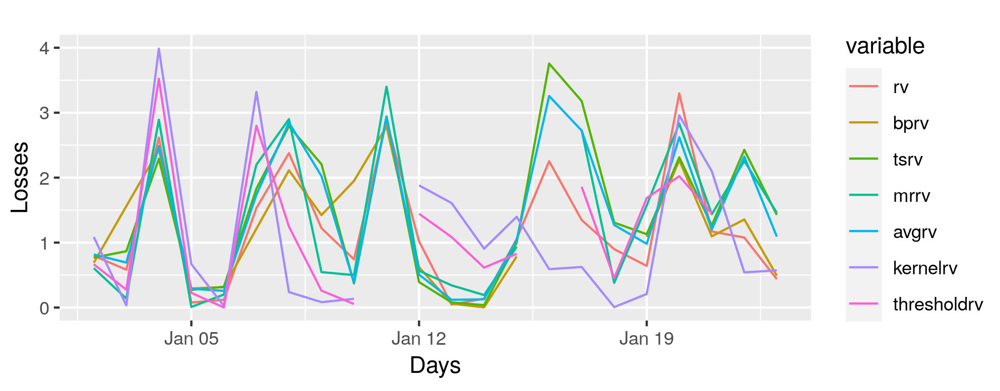

```{r, setup, include=FALSE}
knitr::opts_chunk$set(warning=FALSE,
                      message=FALSE,
                      echo=FALSE, 
                      fig.width=8)
## collapse = TRUE
# dec = 'jpeg'
# eval = FALSE
# https://yihui.org/knitr/options/#chunk-options
```

The following are useful for understanding R Markdown:

- [Authoring Books and Technical Documents with R Markdown](https://bookdown.org/yihui/bookdown/)
- [R Markdown: The Definitive Guide](https://bookdown.org/yihui/rmarkdown/)
- [R Markdown Cookbook](https://bookdown.org/yihui/rmarkdown-cookbook/)


# Markdown Syntax

**EMTH**, *Italic*, H~2~SO~4~, Fe^2+^, Footnote^[Some footnote]

- list
- list

1. Numbered list
1. Numbered list

a. Alternative numbered list
b. Alternative numbered list

Inline Math $a^2+b^2$, Math block:
$$
\sum_{i=1}^{\infty}\frac{1}{n^2}=\frac{\pi^2}{6}
$$

# Markdown extensions by bookdown

Bookdown supply an extension of pandoc, which is already a superset of plain markdwon and TeX.

## Cross reference and citation

@R-bookdown supply a neat way to do cross citation of "theorems"(or numbered environment) and proofs(or unnumbered environment), in which you can write anything freely(even recursively)[@bookdown2016; @rmarkdown2020].

Check source code of theorem \@ref(thm:t1), figure \@ref(fig:fig1), table \@ref(tab:tab1) to see how they work.


We refer to [here](https://bookdown.org/yihui/bookdown/markdown-extensions-by-bookdown.html#theorems) for all supported environments.


::: {.theorem #t1 name="Fermat's Last Theorem"}

For $n\ge 2$, there is no $a,b,c\in \mathbb{N}^* \text{ s.t. }$
$$
a^{n}+b^{n}=c^{n}
$$


:::


:::: {.proof}

 I have discovered a truly marvelous proof of this, which this margin is too narrow to contain


::::


```{r fig1, fig.align = "center", fig.cap="Text figures", out.width = '70%'}



```


```{r tab1}

knitr::kable(
  head(mtcars[, 1:8], 10), booktabs = TRUE,
  caption = 'A table of the first 10 rows of the mtcars data.'
)

```

# Chapter


```{=latex}

\lipsum[1]

```


```{=latex}

\clearpage
\参考文献

```

<div id="refs"></div>

\newpage

# (APPENDIX) Appendix {-}

# Code

Attach code used here

```{python, file="code/examples/utils.py", eval=FALSE,echo=TRUE}


```


\newpage


# 致谢 {-}


This repo credit to:

- [sustechthesis](https://github.com/iydon/sustechthesis)
- [bookdown](https://github.com/rstudio/bookdown)
- [tinytex](https://github.com/yihui/tinytex)
